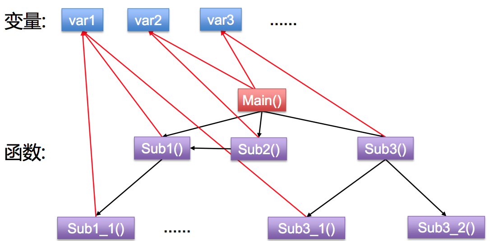
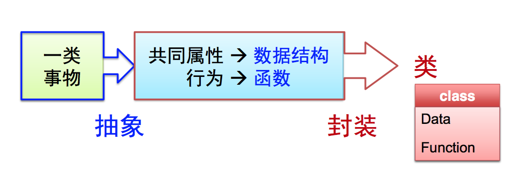
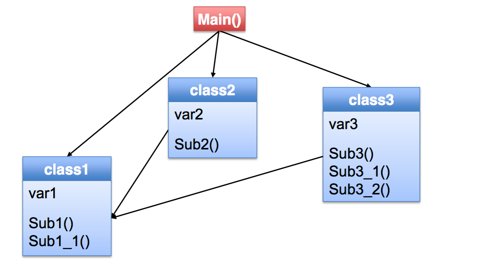
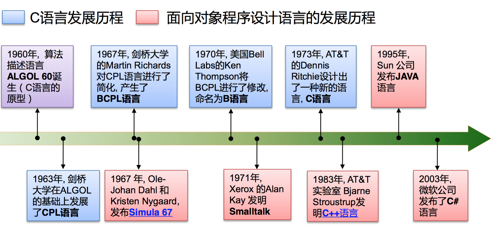

# 从C 走进 C++
### 函数指针和qsort函数
##### 1. 基本概念

程序运行期间,每个函数都会占用一 段连续的内存空间。而函数名就是该函数所 占内存区域的起始地址(也称“入口地址”)。 我们可以将函数的入口地址赋给一个指针变 量,使该指针变量指向该函数。然后通过指 针变量就可以调用这个函数。这种指向函数 的指针变量称为“函数指针”。
#####2. 定义形式

类型名 (* 指针变量名)(参数类型1, 参数类型2,...);

例如: int (*pf)(int ,char); 表示pf是一个函数指针,它所指向的函数,返回值类型应是int, 该函数应有两个参数,第一个是int 类型,第二个是char类型。

##### 3. 使用方法
 可以用一个原型匹配的函数的名字给一个函数指针赋值。要通过函数指针调用它所指向的函数,写法为:
  函数指针名(实参表);

 *实例*
 
    #include <stdio.h>
    void PrintMin(int a,int b){
    if(a < b)
      printf("%d",a);
    else
      printf("%d",b);
    }
    int main(){
      void (* pf)(int, int);
      int x = 4, y = 5;
      pf = PrintMin;
      pf(x,y);
      return 0;
    }

##### 4. qsort库函数
（1）C语言快速排序库函数:

    void qsort(void *base, int nelem, unsigned int width,
        int ( * pfCompare)( const void *, const void *));
        
  可以对任意类型的数组进行排序

(2) 如果对一个数组排序,需要知道:
    - 数组起始地址    base 确定
    - 数组元素的个数   nelem 确定
    - 每个元素的大小(由此可以算出每个元素的地址)  width  确定
    - 元素谁在前谁在后的规则   pfCompare  确定

其中 pfCompare: 函数指针,它指向一个“比较函数”。 该比较函数应为以下形式:
int 函数名(const void * elem1, const void * elem2); 该比较函数是程序员自己编写的

(3)排序就是一个不断比较并交换位置的过程。 qsort函数在执行期间,会通过pfCompare指针调用

“比较函数”,调用时将要比较的两个元素的地址传给“比较函数”,然后根据“比较函数”返回值判断两个元素哪个更应该排在前面。

比较函数编写规则:
1) 如果 * elem1应该排在 * elem2前面,则函数返回值是负整数 2) 如果 * elem1和* elem2哪个排在前面都行,那么函数返回0 3) 如果 * elem1应该排在 * elem2后面,则函数返回值是正整数

*实例:*
下面的程序,功能是调用qsort库函数,将一个unsigned int数组按照个 位数从小到大进行排序。比如 8,23,15三个数,按个位数从小到大排 序,就应该是 23,15,8

    #include <stdio.h>
    #include <stdlib.h>
    int MyCompare( const void * elem1, const void * elem2 ) {
        unsigned int * p1, * p2;
        p1 = (unsigned int *) elem1; // “* elem1” 非法
        p2 = (unsigned int *) elem2; // “* elem2” 非法
        
        return (* p1 % 10) - (* p2 % 10 );
    }
    #define NUM 5
    int main(){
      unsigned int an[NUM] = { 8,123,11,10,4 };
      qsort( an,NUM,sizeof(unsigned int), MyCompare);
      for( int i = 0;i < NUM; i ++ )
        printf("%d ",an[i]); return 0;
    }
    输出结果:
    10 11 123 4 8

### 命令行参数

1.在终端中输入可执行文件名的方式启动程序时,跟在可执行文件名后面的字符串,称为“命令行参数”。命令行参数可以有多个,以空格分隔。比如:

    copy file1.txt file2.txt

其中，“copy”, “file1.txt”, “file2.txt” 就是命令行参数

2.如何在程序中获得命令行参数呢?

    int main(int argc, char * argv[])
    {
          ......
    }
   argc: 代表启动程序时,命令行参数的个数。C/C++语言规定,可执行程序程序本身的文件名,也算一个命令行参数,因此,argc的值 至少是1。
   
   argv: 指针数组,其中的每个元素都是一个char* 类型的指针,该 指针指向一个字符串,这个字符串里就存放着命令行参数。
   
例如,argv[0]指向的字符串就是第一个命令行参数,即可执行程序 的文件名,argv[1]指向第二个命令行参数,argv[2]指向第三个命令行参数......。

  *例如以下实例程序：*
    
        
    #include <stdio.h>
      
    int main(int argc, char * argv[])
    {
      for(int i = 0;i < argc; i ++ )
        printf( "%s\n",argv[i]);
      return 0;
    }
    将上面的程序编译后,然后在终端中敲:
    sample para1 para2 s.txt 5 “hello world”
    
    输出结果为:
    sample
    para1
    para2
    s.txt
    5
    hello world

###按位运算符:

C语言提供了6个位操作运算符。这些运算符只能作用于整型操作数，即只能作用于带符号或者无符号的char，short，int与long类型：

##### &  按位与(AND)

   经常用于屏蔽某些二进制位，例如 `n = n & 0177` 可用于将n中除7个低位二进制位外其他各位均置零。

##### |   按位或(OR)

   用于将某些二进制位置1，例如 `x = x | SET_ON`  该语句将x中对应于SET_ON中为1的那些二进制位置置1。

##### ~  按位取反(一元运算符)

用于求二进制整数的反码，即将操作数各二进制位上的1变成0，0变成1. 例如 `x = x & ~077` 将x最后6位置0。

##### ^  按位异或 (XOR)
当两个操作数对应位不相同时，将改为设置为1，否则该位设置为0。

#####<< 左移 和  >> 右移 移动的位数则由右操作数指定(右操作数的值必须是非负值)

对操作数左移n位，其左边空出的n位用由0填补。等价于对操作数乘以2^n。
在对unsigned类型的无符号值进行右移时，通常会对左边的空出的部分用0填补。
在对signed类型的带符号值进行右移时，通常会对左边空出的部分用符号位填补。

    /* getbits 函数： 返回x中从第p位开始的n位 */
    unsigned getbits(unsigned x, int p, int n){
      return (x >> (p + 1 - n) & ~(~0 << n))
    }
    
###引用

##### 1. 引用的概念

 下面的写法定义了一个引用，并将其初始化为引用某个变量:
     
     类型名 & 引用名 = 某变量名;
   
    int n = 4;
    int & r = n;  // r引用了 n, r的类型是 int &
                  //  某个变量的引用，等价于这个变量，相当于该变量的一个别名。
    r = 4;
    cout << r;   //输出 4
    cout << n; //输出 4
    n = 5;
    cout << r; //输出5
   

#####2. 定义引用时一定要将其初始化成引用某个变量。*初始化后，它就一直引用该变量，不会再引用别 的变量了*
*引用只能引用变量，不能引用常量和表达式*。

    double a = 4, b = 5;
    double & r1 = a;
    double & r2 = r1;  // r2也引用 a
    r2 = 10;
    cout << a << endl; // 输出 10
    r1 = b;    // r1并没有引用b
    cout << a << endl; //输出 5

**引用应用的简单示例**
######(1).引用作为参数使用:

    void swap( int & a, int & b) {
       int tmp;
       tmp = a;
       a = b;
       b = tmp;
    }
    int n1, n2;
    swap(n1,n2) ; // n1,n2的值被交换

######(2). 引用作为函数的返回值

    int n = 4;
    int & SetValue() {
       return n;
    }
    int main() {
      SetValue() = 40;  #使用函数名作为左值
      cout << n;
      return 0;
    } //输出： 40

##### 3. 定义引用时，前面加const关键字，即为“常引用”

    int n;
    const int & r = n; r 的类型是 const int &
  
  常引用不能通过常引用去修改其引用的内容:
    
    int n = 100;
    const int & r = n;
    r = 200; //编译错
    n = 300; // 没问题
*const T & 和T & 是不同的类型!!!*
T& 类型的引用或T类型的变量可以用来初始化const T& 类型的引用。 `const T` 类型的常变量和`const T&` 类型的引用则不能用来初始化T &类型的引用，除非进行强制类型转换。
`T  <->   T &  —>  const T&`       `const T X -> T&`

### “const”关键字的用法
#####1. 定义常量

    const int MAX_VAL = 23；
    const string SCHOOL_NAME = “Peking University” ；

#####2. 定义常量指针

(1)不可通过常量指针修改其指向的内容

    int n,m;
    const int * p = & n;
    * p = 5; //编译出错
    n = 4;//
    ok p = &m;   //ok, 常量指针的指向可以变化

(2)不能把常量指针赋值给非常量指针，反过来可以

    const int * p1;
    int * p2;
    p1 = p2; //ok
    p2 = p1; //error
    p2 = (int * ) p1;  //ok,强制类型转换

(3)函数参数为常量指针时，可避免函数内部不小心改变 参数指针所指地方的内容
    
      void MyPrintf( const char * p ) {
        strcpy(p,"this");  //编译出错
        printf("%s",p);   //ok
      }

#####3. 定义常引用 不能通过常引用修改其引用的变量

    int n;
    const int & r = n;
    r = 5; //error
    n = 4; //ok

### 动态内存分配

#####用new 运算符实现动态内存分配

第一种用法,分配一个变量:`P = new T;`T是任意类型名,P是类型为T * 的指针。动态分配出一片大小为 sizeof(T)字节的内存空间,并且将该 内存空间的起始地址赋值给P。比如:

    int * pn;
    pn = new int; * pn = 5;

第二种用法,分配一个数组:`P = new T[N];`

   T :任意类型名
   
   P :类型为T * 的指针
   
   N :要分配的数组元素的个数,可以是整型表达式
   
    动态分配出一片大小为 sizeof(T)字节的内存空间,并且 将该内存空间的起始地址赋值给P。
    
     int * pn;
     int i = 5;
     pn = new int[i * 20];
     pn[0] = 20;
     pn[100] = 30; //编译没问题。运行时导致数组越界

#####用delete运算符释放动态分配的内存
用“new”动态分配的内存空间,一定要用 “delete”运算符进行释放
     `delete 指针; //该指针必须指向new出来的空间`

    int * p = new int;
    * p = 5;
    delete p;
    delete p; //导致异常,一片空间不能被delete多次
    
 用delete运算符释放动态分配的数组,用“delete”释放动态分配的数组,要加“[]”
 
    delete [ ] 指针;//该指针必须指向new出来的数组
    int * p = new int[20]; p[0] = 1;
    delete [ ] p;

### 内联函数

 函数调用是有时间开销的。如果函数本身只有几条语 句,执行非常快,而且函数被反复执行很多次,相比 之下调用函数所产生的这个开销就会显得比较大。
 为了减少函数调用的开销,引入了内联函数机制。编译器处理对内联函数的调用语句时,是将整个函数的 代码插入到调用语句处,而不会产生调用函数的语句。

  
    inline int Max(int a,int b) {
        if( a > b)
           return a;
        return b;
    }

### 函数重载

   一个或多个函数,名字相同,然而参数个数或参数类型不相同,这叫做函数的重载。（返回值不同不能算函数重载）
以下三个函数是重载关系:
    
    int Max(double f1,double f2) { }   （1）
    int Max(int n1,int n2) { }         （2）
    int Max(int n1,int n2,int n3) { }  （3）

函数重载使得函数命名变得简单。编译器根据调用语句的中的实参的个数和类型判断应该调用哪个函数。

    Max(3.4,2.5);  //调用 (1)  
    Max(2,4);      //调用 (2) 
    Max(1,2,3);     //调用 (3) 
    Max(3,2.4);   //error,二义性

###函数的缺省参数 ：

 C++中,定义函数的时候可以让最右边的连续若干个参数有缺省值,那么调用函数的时候,若相应位置不写参数,参数就是缺省值。

    `void func( int x1, int x2 = 2, int x3 = 3) { }`
    func(10 ); //等效于 func(10,2,3)
    func(10,8) ; //等效于 func(10,8,3)
    func(10, , 8) ; //不行,只能最右边的连续若干个参数缺省

  函数参数可缺省的目的在于提高程序的可扩充性。即如果某个写好的函数要添加新的参数,而原先那些 调用该函数的语句,未必需要使用新增的参数,那么 为了避免对原先那些函数调用语句的修改,就可以使 用缺省参数。
  
  
  
###结构化程序设计：
##### 结构化程序设计

- 复杂的大问题 -> 层层分解/模块化 -> 若干子问题
- 自顶向下, 逐步求精
- 结构化程序设计: 程序 = 数据结构 + 算法

##### 结构化程序的程序模式：

##### 存在的问题：
- 数据结构和算法没有直观的联系
- 理解难，修改难，查错难，重用难

##### 面向对象的程序设计：

面向对象的程序 = 类 + 类 + ... + 类

面向对象的程序设计方法:

面向对象的程序模式

类的定义:

    class 类名
	{
		访问范围说明符:
		成员变量1
		成员变量2
		...
		成员函数声明1
		成员函数声明2

		访问范围说明符:
		更多成员变量
		更多成员函数声明
		...
	};
	

### 面向对象程序设计 语言的发展历程
##### 1. 早期程序设计语言的历史

##### 2. C++语言的历史
- 1979年, AT&T实验室Dr. Bjarne Stroustrup开始发明  开始的版本称为: C with Classes
- 1983年8月, 第一个C++实现投入使用 1983年10月, 正式命名为C++ (CPlusPlus)
- 1985年10月, Bjarne完成了经典巨著The C++ Programming Language (第一版)
- 1989年, C++2.0版发布
- 1994年, ANSI C++标准发布
- 1998年, ANSI和ISO联合发布 “C++98” 标准 • 加入STL (Standard Template Library) – 泛型设计
- 2003年, ISO的C++标准委员会发布 “C++03” 标准 2005年, “Library Technical Report 1” (TR1) 技术报告发布
- 2011年9月, ISO标准委员会通过了新的C++标准 -- C++11

##### 3. 常用的C++编译器
- GCC
- Visual C++ 10.0 Dev C++
- Eclipse
- Borland C++Builder 



### 从客观事物抽象出类的例子

#####写一个程序, 输入矩形的宽和高, 输出面积和周长
- 矩形的属性
    + 宽和高
- 对矩形的操作 
	+ 设置宽和高
	+ 计算面积
	+ 计算周长 

		
			class CRectangle {
			public: 
				int w, h; // 成员变量            
				void Init( int w_, int h_ ) {    // 成员函数         
					w = w_;             
					h = h_;         
				}         
				int Area() {             
					return w * h;         
				}         
				int Perimeter() {             
					return 2 * ( w + h );         
				}     
			};
			
			int main() { 
				int w, h; 
				CRectangle r;  //r是一个对象 
				cin >> w >> h; 
				r.Init(w, h); 
				cout << r.Area() << endl << r. Perimeter(); 
				return 0; 
			}

#####对象的内存分配
对象的内存空间

• 对象的大小 = 所有成员变量的大小之和

• E.g. CRectangle类的对象, sizeof(CRectangle) = 8

每个对象各有自己的存储空间

一个对象的某个成员变量被改变, 不会影响到其他的对象


##### 对象间的运算
对象之间可以用 ‘=’ 进行赋值

不能用 ‘==’, ‘!=’, ‘>’, ‘<’, ‘>=’, ‘<=’进行比较 • 除非这些运算符经过了 “重载”

#####访问类的成员变量和成员函数
- 用法1: 对象名.成员名 

		CRectangle r1, r2;
		r1.w = 5; 
		r2.Init(3,4);

		

- 用法2: 指针->成员名
		

		CRectangle r1, r2;
		CRectangle * p1 = & r1;
		CRectangle * p2 = & r2;
		p1->w = 5;
		p2->Init(3,4); //Init作用在p2指向的对象上

		

- 用法3: 引用名.成员名 

		CRectangle r2; 
		CRectangle & rr = r2; 
		rr.w = 5;
		rr.Init(3,4); //rr的值变了,r2的值也变

		

#####成员函数体和类的定义分开写

		class CRectangle {
		public:
			int w, h;
			int Area(); //成员函数仅在此处声明 int Perimeter() ;
			void Init( int w_, int h_ );
		};

		int CRectangle::Area() { 
            return w * h;
		}
		int CRectangle::Perimeter() {
			return 2 * ( w + h ); 
		}
		void CRectangle::Init( int w_, int h_ ) { 
			w=w_; h=h_;
		}

		

###类成员的可访问范围

类成员的可访问范围

		class className {
			private:
				私有属性和函数, 只能在成员函数内被访问
			public:
				公有属性和函数, 可以在任何地方被访问
			protected:
				保护属性和函数
		};



1. 三种关键字出现的次数和先后次序都没有限制
2. 设置私有成员的目的:强制对成员变量的访问一定要通过成员函数进行
 设置私有成员的机制 -- 隐藏		
3. 缺省为私有成员
4. 类的成员函数内部, 可以访问:

当前对象的全部属性, 函数和同类其它对象的全部属性, 函数

类的成员函数以外的地方:

只能够访问该类对象的公有成员
	